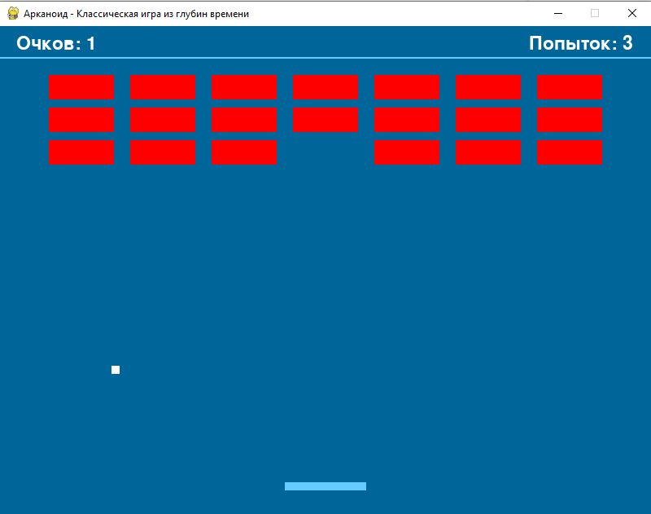

# Arcanoid
Классическая игра из глубин времени

### Запуск игры
Чтобы начать играть запустите файл arcanoid.exe

### Правила игры
Перемещая платформу, отбивайте шарик. Разбейте как можно больше кирпичиков. Один кирпичик - один балл. У вас есть 3 жизни, то есть право три раза уронить шарик. После этого игра закончивается

